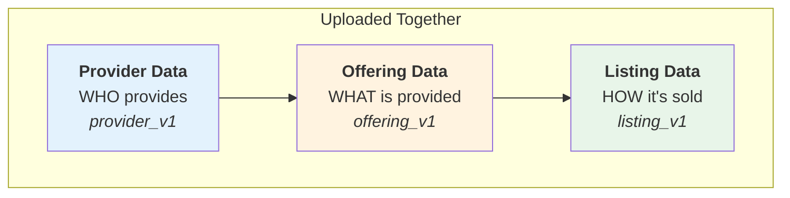

# CLI Guide

Hands-on guide for common CLI workflows. For the complete list of
commands and options, see the [CLI Reference](cli-reference.md).

All examples use the shorter `usvc_seller` alias. You can always
substitute `unitysvc_sellers` if preferred.

## Commands overview

The CLI is organized into command groups with a clear separation:

### Local data operations (`usvc_seller data`)

Work with local data files — can be used offline without API credentials
(except `upload`).

| Command      | Description                                         |
| ------------ | --------------------------------------------------- |
| `validate`   | Validate data files against schemas                 |
| `format`     | Format/prettify data files                          |
| `populate`   | Generate data files from provider scripts           |
| `upload`     | Upload local data to backend (draft status)         |
| `list`       | List local data files (services, providers, etc.)   |
| `show`       | Show details of a local data object                 |
| `list-tests` | List code examples in local data                    |
| `run-tests`  | Run code examples locally with upstream credentials |
| `show-test`  | Show details of a local test                        |

### Remote service operations (`usvc_seller services`)

Manage services on the backend — requires API credentials.

| Command       | Description                                   |
| ------------- | --------------------------------------------- |
| `list`        | List deployed services on backend             |
| `show`        | Show details of a deployed service            |
| `submit`      | Submit draft service(s) for ops review        |
| `withdraw`    | Withdraw pending/rejected service(s) to draft |
| `deprecate`   | Deprecate active service(s)                   |
| `delete`      | Delete service(s) from backend                |
| `dedup`       | Remove duplicate draft services               |
| `list-tests`  | List tests for deployed services              |
| `show-test`   | Show details of a test for a deployed service |
| `run-tests`   | Run tests via gateway (backend execution)     |
| `skip-test`   | Mark a code example test as skipped           |
| `unskip-test` | Remove skip status from a test                |

### Promotion management (`usvc_seller promotions`)

| Command    | Description                                             |
| ---------- | ------------------------------------------------------- |
| `list`     | List promotions on the backend                          |
| `show`     | Show details of a promotion (including generated codes) |
| `activate` | Activate a promotion                                    |
| `pause`    | Pause a promotion                                       |
| `delete`   | Delete a promotion                                      |

### Secrets management (`usvc_seller secrets`)

| Command  | Description                  |
| -------- | ---------------------------- |
| `list`   | List secrets                 |
| `show`   | Show secret metadata         |
| `create` | Create a new secret          |
| `rotate` | Rotate an existing secret    |
| `delete` | Delete a secret              |

### Service groups (`usvc_seller groups`)

| Command | Description                        |
| ------- | ---------------------------------- |
| `list`  | List service groups on the backend |
| `show`  | Show details of a group            |
| `delete`| Delete a group                     |

---

## How uploading works

A **Service** in UnitySVC consists of three data components uploaded
together:



When you run `usvc_seller data upload`:

1. **Finds** all listing files (`listing_v1` schema) in the directory tree
2. For each listing, **locates** the offering file (`offering_v1`) in the same directory
3. **Locates** the provider file (`provider_v1`) in the parent directory
4. **Uploads** all three together to the `/seller/services` endpoint

This ensures atomic uploading — all three components are validated and
uploaded as a single unit.

### Dryrun mode

The `--dryrun` option previews what would happen without making changes:

```bash
usvc_seller data upload --dryrun
```

- Backend returns what action would be taken (create/update/unchanged)
- Missing files are reported as errors
- Summary shows what would happen if uploaded for real

### Status indicators

| Symbol | Status    | Meaning                                 |
| ------ | --------- | --------------------------------------- |
| `+`    | Created   | New service uploaded for the first time |
| `~`    | Updated   | Existing service updated with changes   |
| `=`    | Unchanged | Service already exists and is identical |
| `⊘`    | Skipped   | Service has draft status or deprecated without service_id |
| `✗`    | Failed    | Error during uploading                  |

### Upload rules based on status

| Condition | Behavior |
|-----------|----------|
| Any status is `draft` | **Skip** — still being configured |
| Any status is `deprecated` (none draft) | **Upload if `service_id` exists** — deprecates on server |
| Any status is `deprecated` (no `service_id`) | **Skip** — cannot deprecate what doesn't exist on server |
| All statuses are `ready` | **Upload** — normal upload |

### Override files and service ID persistence

After a successful first upload, the SDK saves the `service_id` to an
override file:

```
listing.json       ->  listing.override.json
listing.toml       ->  listing.override.toml
```

The `service_id` ensures subsequent uploads **update** the existing
service rather than creating a new one. To upload as new, delete the
override file first.

---

## Promotion file format

Promotion files use the `promotion_v1` schema and live in a
`promotions/` directory alongside service data:

```
seller-data/
+-- provider.json
+-- services/
|   +-- my-llm/
|       +-- offering.json
|       +-- listing.json
+-- promotions/
    +-- summer-discount.json
    +-- volume-tier.json
```

### Fields

| Field | Type | Default | Description |
|-------|------|---------|-------------|
| `schema` | str | `"promotion_v1"` | File schema identifier (stripped before upload) |
| `name` | str | **required** | Unique per seller. Used for idempotent upsert |
| `description` | str \| null | null | Human-readable description |
| `scope` | dict \| null | null | Who + where the promotion applies |
| `pricing` | dict | **required** | Pricing adjustment (Pricing union type) |
| `apply_at` | str | `"request"` | `"request"` (per API call) or `"statement"` (billing) |
| `priority` | int | 0 | Higher-priority rules applied first |
| `status` | str | `"draft"` | `"draft"`, `"active"`, `"paused"`, etc. |
| `expires_at` | datetime \| null | null | When the promotion expires (code-based only) |
| `max_uses` | int \| null | null | Maximum total redemptions (code-based only) |

### Scope

The `scope` field controls which **customers** and **services** a
promotion applies to. When omitted, the promotion is a blanket discount.

**Customer targeting** (`scope.customers`):

| Value | Effect |
|-------|--------|
| `"*"` or omitted | All customers (blanket) |
| `{"code": "SUMMER25"}` | Customers who redeem this code |
| `{"code": "{{ promotion_code(6) }}"}` | Backend auto-generates a 6-char code |
| `{"subscription": "premium"}` | Customers on a specific plan tier |
| `["id1", "id2"]` | Specific customers |

**Service targeting** (`scope.services`):

| Value | Effect |
|-------|--------|
| `"*"` or omitted | All of this seller's services |
| `["gpt-4", "gpt-4-enterprise"]` | Specific services by name |

### Promotion examples

**Blanket discount** — 20% off everything:

```json
{
  "schema": "promotion_v1",
  "name": "summer-sale",
  "pricing": {"type": "multiply", "factor": "0.80"},
  "status": "active"
}
```

**Code-based with auto-generated code:**

```json
{
  "schema": "promotion_v1",
  "name": "vip-discount",
  "scope": {"customers": {"code": "{{ promotion_code(6) }}"}},
  "pricing": {"type": "multiply", "factor": "0.70"},
  "expires_at": "2026-12-31T00:00:00Z",
  "max_uses": 100
}
```

After upload, `usvc_seller promotions show vip-discount` will show the
generated code.

---

## Environment variables

| Variable                  | Description            | Used by                          |
| ------------------------- | ---------------------- | -------------------------------- |
| `UNITYSVC_SELLER_API_URL` | Seller backend API URL | All remote commands              |
| `UNITYSVC_SELLER_API_KEY` | Seller API key         | All remote commands              |
| `UNITYSVC_API_KEY`        | Customer API key       | `services run-tests` (gateway)   |
| `UNITYSVC_API_URL`        | Gateway API URL        | `services run-tests` (gateway)   |

```bash
export UNITYSVC_SELLER_API_URL=https://seller.unitysvc.com/v1
export UNITYSVC_SELLER_API_KEY=svcpass_your-api-key
```

---

## Common workflows

### Full upload flow

```bash
# Set seller environment
export UNITYSVC_SELLER_API_URL=https://seller.unitysvc.com/v1
export UNITYSVC_SELLER_API_KEY=svcpass_your-seller-api-key

# Validate and format locally
usvc_seller data validate
usvc_seller data format

# Test code examples locally
usvc_seller data list-tests
usvc_seller data run-tests

# Preview changes (recommended)
cd data
usvc_seller data upload --dryrun

# Upload
usvc_seller data upload

# Verify on backend
usvc_seller services list

# Run tests via gateway
export UNITYSVC_API_KEY=your-customer-api-key
export UNITYSVC_API_URL=https://backend.unitysvc.com/v1
usvc_seller services run-tests <service-id>

# Submit for review
usvc_seller services submit <service-id>
```

### Update and re-upload

```bash
# Edit local files, then:
usvc_seller data validate
usvc_seller data upload --dryrun
usvc_seller data upload
```

### Automated generation

```bash
usvc_seller data populate
usvc_seller data validate
usvc_seller data format
cd data
usvc_seller data upload --dryrun
usvc_seller data upload
```

### Managing test status

```bash
# Skip a test that requires special hardware
usvc_seller services skip-test <service-id> -t "Demo that requires GPU"

# Re-enable
usvc_seller services unskip-test <service-id> -t "Demo that requires GPU"

# View details
usvc_seller services show-test <service-id> -t "Python Example"
```

---

## See also

- [CLI Reference](cli-reference.md) — Complete command and option listing
- [Getting Started](getting-started.md) — First steps tutorial
- [Workflows](workflows.md) — Additional usage patterns
- [Data Structure](data-structure.md) — File organization rules
- [Code Examples](code-examples.md) — Creating and testing code examples
- [SDK Guide](sdk-guide.md) — Python SDK usage
