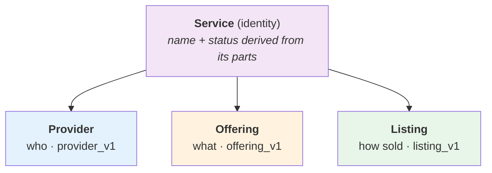
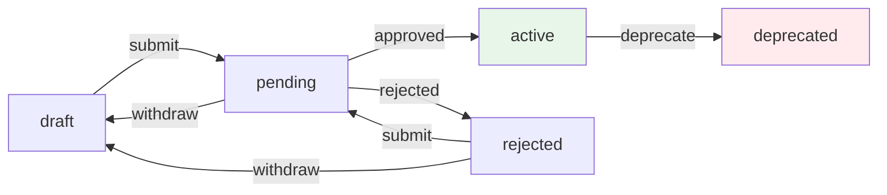

# Services

A **service** is the unit you publish on UnitySVC: one thing a customer can
subscribe to and call through the gateway. This page covers what a service is
made of, the two ways to create one, and how it moves through its status
lifecycle once it's on the platform.

## What a service is made of

On the platform a **Service** is an *identity layer* — a stable record that
subscriptions and billing reference. Its content comes from three complementary
parts, each with its own schema:

| Part | Schema | Answers | Reuse |
|---|---|---|---|
| **Provider** | `provider_v1` | **Who** provides it — identity, contact, terms | one definition per provider |
| **Offering** | `offering_v1` | **What** it is — service type, upstream endpoint & credentials, technical details | one per service |
| **Listing** | `listing_v1` | **How** it's sold — customer-facing name, documentation, price | one or more per offering |



The three parts are authored separately but **uploaded together** as one
service. The platform derives the service's **name** from `listing.name` (falling
back to `offering.name`) and its **status** from the parts' statuses.

→ Field-by-field schemas live in **[File Schemas](file-schemas.md)**.

## The `specs/` layout

When you author a service in files, each service is a **self-contained folder**
under `specs/<provider>/<service>/`, holding its three parts plus an optional
`service.json`:

```
specs/
└── openai/                       # provider segment
    ├── gpt-4/                     # one service folder…
    │   ├── provider.json          # provider_v1 — who
    │   ├── offering.json          # offering_v1 — what
    │   ├── listing.json           # listing_v1  — how sold
    │   └── service.json           # backend service_id (written on first upload)
    └── gpt-4-mini/
        ├── provider.json
        ├── offering.json
        └── listing.json
```

A few rules make this layout unambiguous:

-   **Filename is the type.** A file's role comes from its name
    (`provider` / `offering` / `listing`) — there is no `schema` field inside.
-   **The folder path *is* the service name.** The folder under `specs/` equals
    `listing.name` (e.g. `openai/gpt-4`). Nesting deeper (`openai/org/model`) is
    fine for namespaced ids.
-   **Self-contained folders.** Each folder carries its own `provider.json`, so a
    service can be validated, tested, and uploaded on its own.

Validate and format the repo before uploading:

```bash
usvc_seller specs validate     # schema + layout checks
usvc_seller specs format       # canonical JSON/TOML formatting
```

## Two ways to create a service

`specs` and `params` are two routes to the same destination — a service on the
platform. Author full files when you need control; instantiate a template when
you want speed.

### Path A — author specs and upload

Define your services under `specs/` and upload. There are three ways to author
them, all handled by the same `specs` commands:

- **Spelled-out folders** — write the `provider` / `offering` / `listing` files by
  hand (or export them from the dashboard). → [Author & Upload Specs](guides/author-specs.md)
- **Param files** — when several services share one shape, author one local
  template + a tiny `{ template, parameters }` file each, rendered on the fly. →
  [Compact Specs with Param Files](guides/param-files.md)
- **A populator** — generate (and keep in sync) many services from a source list. →
  [Generate a Catalog](guides/generate-catalog.md)

```bash
usvc_seller specs upload          # uploads every service in the repo
```

Upload is **listing-centric**: for each listing the SDK gathers the offering and
provider in the same folder and sends all three as one unified service.

**Service identity is tracked in `service.json`.** On the *first* upload of a
folder a **new service is created** and its `service_id` is written back to
`service.json`. Commit that file — on later uploads the SDK reads it to update
*the same* service instead of creating a duplicate. Delete it to upload as a
brand-new service (e.g. a copy, or a different environment).

### Path B — instantiate a template with params

If the platform already publishes a template for your service type, you don't
author any files — you provide **parameters** and the platform renders the
service for you:

```bash
usvc_seller templates list                         # browse available templates
usvc_seller templates show openai-compatible-llm   # see its parameters
usvc_seller params instantiate openai-compatible-llm \
    -P api_base_url=https://api.example.com/v1 \
    -P api_key_secret_name=UPSTREAM_API_KEY \
    -P input_price=1.00
```

`params instantiate` is the template analog of `specs upload`: it renders the
template into a complete service and (by default) submits it for review.
Secret-typed parameters take a **secret name** — create it first with
`usvc_seller secrets` — never the raw value.

→ Platform templates, capability pools, and authoring your own are covered in
**[Service Templates](service-templates.md)**.

## Service status and updates

Once a service exists on the platform it moves through a status lifecycle. You
drive the transitions with `usvc_seller services …` (or `client.services` from
the SDK).



| Action | Command | Effect |
|---|---|---|
| **Submit for review** | `services submit` | `draft` / `rejected` → `pending` |
| **Withdraw** | `services withdraw` | `pending` / `rejected` → `draft` |
| **Deprecate** | `services deprecate` | mark a live service `deprecated` |
| **Set visibility** | `services set-visibility` | `public` (on the marketplace) or `unlisted` |
| **Inspect** | `services list` / `services show` | see status, visibility, documents, access interfaces |

### Updating a service

There are two ways to change a service that already exists:

-   **Re-upload its specs** (`specs upload`) — for content changes (new
    documentation, pricing shape, upstream config). The SDK matches the service
    by the `service_id` in `service.json`.
-   **Patch it directly** (`services update`) — for quick, targeted changes to a
    **live** service's visibility, routing variables, or list price, without
    re-uploading files.

**Live services update through revisions.** When you re-upload to a service
that's already `active`, the change lands as a **draft revision** rather than
editing the live service in place — so customers keep hitting a stable service
until the revision is reviewed and activated. The `service_id` stays the same
throughout, so subscriptions and enrollments are never disrupted.

→ What happens after activation — review, marketplace listing, billing, and
payouts — is covered in **[Seller Lifecycle](seller-lifecycle.md)**.

## Testing a service

Services ship with testable documents (code examples, connectivity checks). Run
them locally against your upstream, or as a server-side diagnostic:

```bash
usvc_seller specs run-tests              # locally, with your upstream credentials
usvc_seller services run-tests <name>    # server-side diagnostic on a live service
```

→ See **[Code Examples](code-examples.md)** and
**[Documenting Services](documenting-services.md)** for authoring testable docs.
